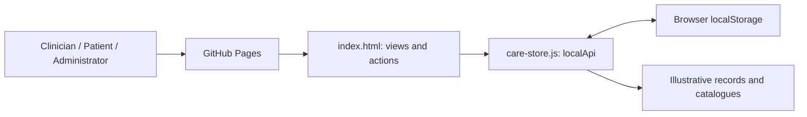
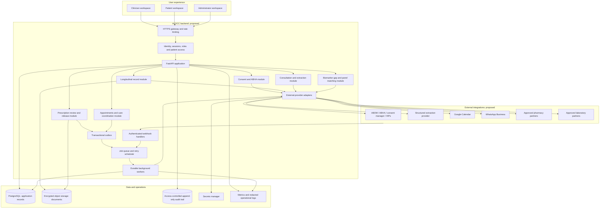
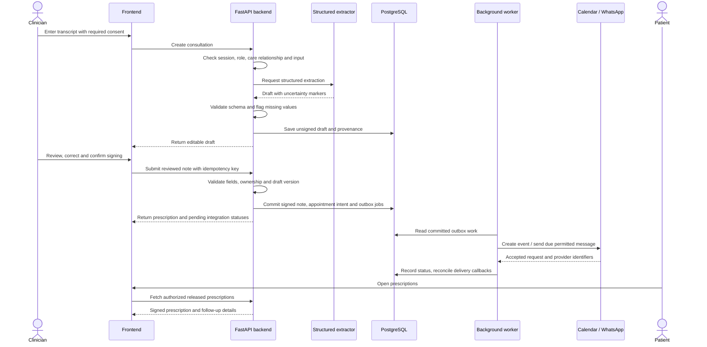
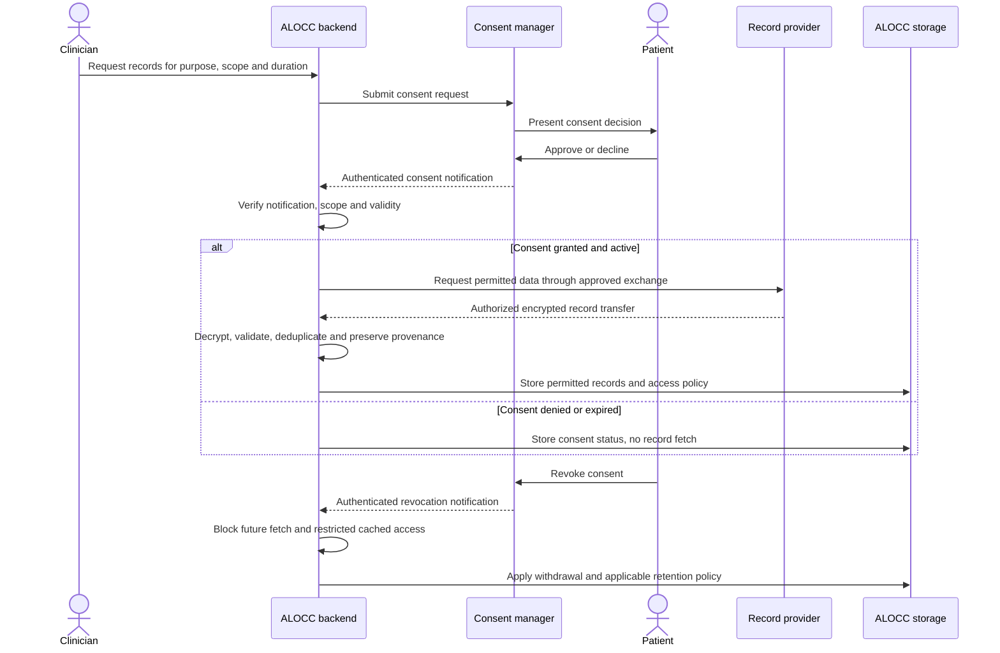
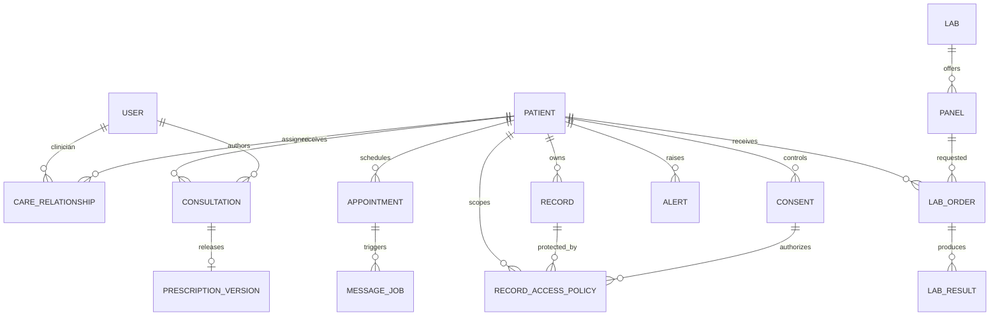
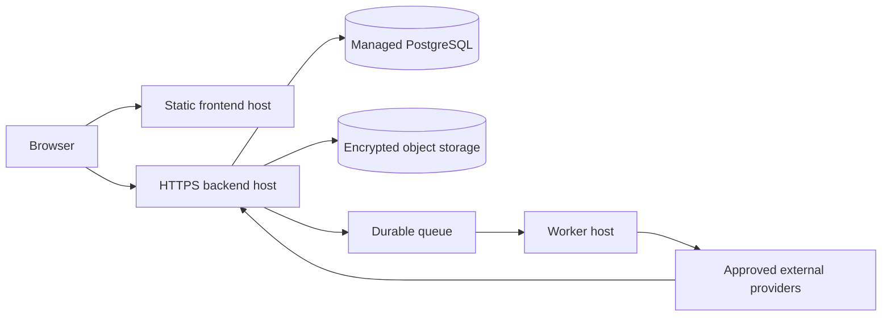

# ALOCC architecture and ideal backend flow

## Design status

This document proposes the complete ALOCC system. The published GitHub Pages website currently implements the browser experience only. Boxes labelled as backend services or integrations below describe future implementation, not live capabilities.

The original development workspace includes a FastAPI/SQLite prototype with server-side patient access checks, consultation drafts, prescription validation, consent records, matching logic, and an activity log. Its Claude extraction path is implemented; ABDM, WhatsApp, and Google Calendar real adapters remain unimplemented. It is a useful starting point, but not a production backend.

## Current published architecture

There are no live service calls or server-side trust boundaries in this version. Browser profile selection must never be reused as production authentication.

## Proposed complete architecture

Start with a modular FastAPI backend and a separate background-worker process. Separate modules by responsibility without requiring a microservice deployment for each module.

### Component responsibilities

- **Frontend:** renders each workspace, collects user input, displays statuses, and presents notes for clinician review. It never stores service secrets or authorizes access to another patient's records.
- **Identity and access:** authenticated clinician, patient, and admin sessions; expiring sessions; server-side roles and patient-care relationships; stronger controls for privileged accounts.
- **Consent and ABHA:** verified identity-linking workflows, consent scope and validity, requests, decisions, revocation, and provider-specific exchange orchestration.
- **Records:** normalizes incoming records, preserves source and provenance, manages versioning, and applies consent to every read and transfer.
- **Scribe:** accepts consented transcripts, invokes a configured extractor, validates structured output, records uncertainty, and saves an unsigned draft. AI output never becomes a prescription automatically.
- **Prescriptions:** validates clinician-edited notes, freezes a signed version, creates printable documents and profile-validated FHIR resources, and releases the result to the correct patient.
- **Matching:** compares verified patient biomarkers against a clinician-maintained reference set, filters compatible samples, and ranks approved laboratory panels with reasons.
- **Coordination:** manages appointments, patient preferences, check-ins, clinician alerts, and reminder schedules.
- **Adapters:** isolate vendor protocols, authentication, timeouts, response normalization, and error handling. Incomplete integrations return a clear unavailable status rather than claiming success.
- **Workers:** execute durable jobs outside the web request, retry transient failures, avoid duplicates, and record provider delivery state.

## Ideal care journey

1. **Authenticate and select the patient.** The backend checks the clinician's role and active care relationship before loading patient details.
2. **Verify or link ABHA.** The patient completes the appropriate verification flow through an approved ABDM integration. The app stores the verified link and provenance, not merely a matching identifier string.
3. **Request prior records.** The clinician requests specific information for a stated purpose and duration. The patient approves or declines through the consent flow.
4. **Fetch only authorized records.** The backend validates active consent, obtains the permitted records through the exchange, decrypts them according to the integration protocol, validates their structure, and updates the timeline with source information.
5. **Capture the consultation.** Text input or consented audio is transcribed. A structured extractor produces diagnosis fields, biomarkers, medicines, tests, advice, and follow-up suggestions, with unknown fields explicitly marked.
6. **Review and release.** The clinician edits the draft, confirms every medicine parameter and follow-up date, and signs. The backend validates and stores an immutable version, then releases it to the patient.
7. **Coordinate follow-up.** Signing commits appointment intent and reminder jobs. Workers create or update calendar events and send permitted template messages at the right time. Delivery callbacks update their status.
8. **Compare medicine options.** The patient requests current partner offers. The backend matches molecule, strength, form, pack quantity, availability, and location, returns timestamps, and presents alternatives for clinician discussion.
9. **Identify missing testing.** The clinician requests matching. The backend uses verified results and approved reference rules to calculate the gap, rank panels, and explain coverage, price, sample needs, and turnaround.
10. **Order and reconcile results.** A selected referral is sent to an approved lab. Validated results are attached to the correct patient and order, reviewed, and added to the timeline.
11. **Handle replies and consent changes.** Patient replies may open a clinician alert. Revocation stops future exchange, invalidates permitted caches, and triggers the defined data-retention workflow.

## Consultation, prescription and reminder sequence

Provider acceptance is not the same as delivery. The frontend should show pending, accepted, delivered, failed, cancelled, and opted-out states accurately.

## Record-access consent sequence

This is a conceptual flow. Exact endpoints, callbacks, encryption and FHIR profiles must follow the current approved ABDM integration requirements. Withdrawal of fetched copies and retention of legally required clinician-created records are separate decisions; a production implementation must define both explicitly.

## Backend interface

The original prototype already groups endpoints along these boundaries. A complete implementation can keep the grouping while adding real authentication, robust validation and provider adapters:

- **Sessions:** `POST /api/login`; add logout, session expiry and refresh or an identity-provider flow.
- **Patients and records:** `GET /api/patients`, `GET /api/patients/{id}`, `GET /api/patients/{id}/timeline`.
- **ABHA and consent:** `POST /api/patients/{id}/abha`, `POST /api/patients/{id}/consents`, `POST /api/consents/{id}/decision`; add authenticated exchange callbacks.
- **Consultations:** `POST /api/consultations`, `POST /api/consultations/{id}/sign`, `GET /api/patients/{id}/prescriptions`, prescription-document and price endpoints.
- **Coordination:** appointment reads, reschedule/cancel actions, messaging preferences, patient replies, and clinician alert resolution.
- **Labs:** `GET /api/labs/match`, `POST /api/orders`, `GET /api/patients/{id}/orders`, result submission and reconciliation.
- **Administration:** controlled catalogue/reference changes and authorized audit queries.

The current frontend's `localApi()` should eventually be replaced by an HTTPS client with session handling and explicit error states. Cross-origin deployments require an exact frontend-origin allowlist and appropriate session/CSRF protections.

## Data model

Additional operational entities include provider connections, idempotency keys, outbox jobs, webhook receipts, versioned biomarker reference sets, audit events, and document-object references. Record access policies should track multiple authorizations for one record rather than assuming every record has exactly one consent.

## Storage, privacy and reliability

- Keep application data in a transactional database and document binaries in encrypted object storage. Use managed secrets; do not ship credentials in browser code.
- Check authorization and active consent on the server for every relevant request, worker execution and record transfer.
- Use short-lived sessions, strong password hashing or a managed identity provider, tenant isolation where needed, and privileged-account controls.
- Retain an access-controlled, tamper-evident audit trail without transcript, drug, diagnosis, token or document contents in operational logs.
- Use an outbox so signed prescriptions and scheduled work commit together. Workers need idempotency, bounded retries, dead-letter handling and reconciliation.
- Verify webhook signatures and replay protection before acting on callbacks. Deduplicate provider events and associate them with the correct patient/order.
- Enforce messaging opt-in again at send time. On cancellation, rescheduling or opt-out, invalidate stale jobs rather than leaving them queued.
- Set AI-processing consent and retention rules explicitly. Validate extracted fields; avoid default doses or invented findings. Provider failure should leave a reviewable draft or a clear error.
- Back up durable storage, test restoration, define deletion/retention rules, and monitor failed jobs and access failures.

## Deployment boundaries

GitHub Pages can host the static frontend. It does not host the Python application, database, scheduled worker or incoming integration webhooks. Those require an appropriate backend environment and stable HTTPS callback URLs. Backend readiness, worker readiness and provider connection health should be observed separately.

## Implementation order

1. **Backend foundation:** production identity, roles, care relationships, database migrations, secrets, audit and a verified frontend-to-API connection.
2. **Clinical workflow:** consultation validation, review and prescription versioning, reliable appointment state, document generation and reference-data governance.
3. **Durable coordination:** outbox, workers, retries, opt-in handling, alert assignment and delivery reconciliation.
4. **Approved integrations:** ABDM sandbox workflows and conformance, calendar authorization, WhatsApp templates/webhooks, and contracted pharmacy/lab providers.
5. **Release validation:** security, accessibility, end-to-end consent tests, cross-patient access tests, workflow recovery tests, clinical review and operational readiness.

The architecture is a design proposal. It does not represent completed ABDM certification, clinical validation, provider approval or a deployed backend.

## Integration and framework references

- [GitHub Pages hosting model](https://docs.github.com/en/pages/getting-started-with-github-pages/what-is-github-pages): static HTML, CSS and JavaScript hosting.
- [FastAPI background tasks](https://fastapi.tiangolo.com/tutorial/background-tasks/): request-process background work and the distinction from a separate worker/queue design.
- [Google Calendar authorization scopes](https://developers.google.com/workspace/calendar/api/auth): select the permissions needed for the doctor's calendar connection.
- [ABDM sandbox](https://sandbox.abdm.gov.in/sandbox/v3): entry point for approved sandbox integration and current specifications.
- [Claude authentication](https://platform.claude.com/docs/en/manage-claude/authentication): server-side API credential setup for the existing extraction adapter.
